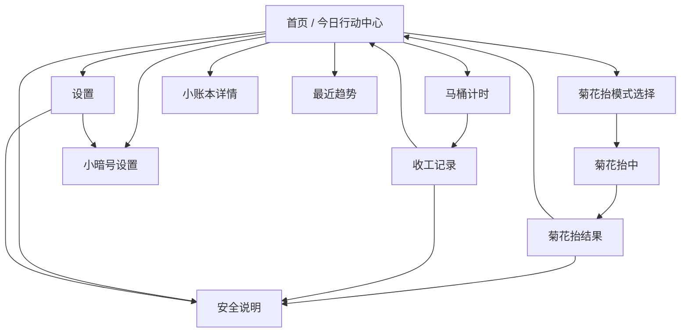

# 肛肛好 UI 交互设计文档

版本：v0.1  
日期：2026-05-18  
阶段：V1 当前实现与后续设计基线  
关联文档：[产品定位文档](./product-positioning.md)、[PRD](./prd-v0.1.md)、[开发方案](./development-plan.md)、[整体风格设计指南](./visual-style-guide.md)

## 1. 文档目的

本文档用于把肛肛好当前产品文档转化为可执行的 UI 与交互规范，覆盖：

- App 的信息架构、导航结构和页面优先级。
- 首页、菊花抬、马桶计时、小账本、小暗号、趋势、安全说明、设置等核心页面的交互细节。
- 组件、状态、动效、反馈、空状态、异常状态、可访问性与验收标准。
- 产品文案与视觉表达在 UI 中的使用边界。

本文档面向产品、设计、前端开发和测试。它不是医疗内容审核文档，也不是视觉稿源文件。涉及医学建议时，只定义交互优先级和表达边界，不判断病因，不提供治疗方案。

## 2. 产品与体验定位

### 2.1 一句话体验目标

肛肛好是一款面向久坐人群的私密健康习惯工具，让用户在不尴尬、不复杂、不被吓唬的前提下，每天顺手完成菊花抬、马桶计时、小账本打卡和提醒设置。

### 2.2 UI 设计方向

设计方向定义为：

**低声量的私密健康仪表盘。**

它应该像一个放在手机里的小账本和小提醒器，而不是医院 App、健身挑战 App 或搞笑玩具。界面要温和、清楚、有工具感，并用“小花、开张、收工、小暗号”等表达降低尴尬。

记忆点是：

- 首页一眼看到“今天做了什么”。
- 菊花抬用明确节奏而不是复杂教程。
- 马桶计时像一个克制的收工提醒。
- 小账本是一点即记的轻量记录。
- 风险场景立刻收起幽默，进入安全说明。

### 2.3 核心体验原则

| 原则 | UI 解释 | 交互落点 |
| --- | --- | --- |
| 隐私优先 | 页面和通知避免直白暴露敏感词 | 默认开启隐私文案，通知使用“小花”“小暗号”“换个姿势” |
| 低负担 | 高频动作首页完成或一跳可达 | 首页聚合状态、训练、计时、打卡、趋势入口 |
| 轻松克制 | 幽默但不低俗，不羞辱身体 | 使用“开张、下班、收工”，避免恶搞和身体段子 |
| 安全清晰 | 红灯信号不庆祝、不轻描淡写 | 便血、不适、剧烈疼痛等状态使用 danger，并建议咨询医生 |
| 不鼓励过量 | 训练完成建议量即可 | 达标后文案强调休息和放松，不强化“再来一组” |
| 数据轻量 | 看趋势，不做诊断报告 | 7 天小趋势 + 30 天摘要，不做健康评分 |

## 3. 产品范围

### 3.1 V1 当前包含

- 单首页今日行动中心。
- 设置页。
- 菊花抬训练模式选择、训练中、训练结果。
- 马桶计时、收工记录、红灯信号。
- 小账本首页快速打卡和详情页三档调整。
- 小暗号提醒设置，包含隐私模式、勿扰时间和通知权限。
- 今日正反馈。
- 最近趋势，包含最近 7 天和最近 30 天摘要。
- 安全说明。
- 浅色、深色、跟随系统外观模式。
- 本地 SQLite 持久化。

### 3.2 V1 不包含

- 登录注册、账号体系、云同步。
- 在线问诊、AI 诊断、疾病治疗计划。
- 药物推荐、医生报告导出。
- 社区、排行榜、积分、等级、金币。
- Apple Watch、小组件、服务端推送。

### 3.3 设计禁区

- 不把 App 做成医疗恐惧风，不使用病理图、大面积红色、病历式信息展示。
- 不把私密健康问题做成低俗玩笑，不出现身体羞辱或夸张器官拟人化。
- 不把训练做成健身挑战，不使用冲榜、极限、打败别人等表达。
- 不把趋势做成复杂健康报告，不输出诊断结论或健康评分。

## 4. 用户与核心任务

### 4.1 核心用户

- 久坐办公人群，例如程序员、设计师、运营、财务、学生。
- 长时间固定姿势工作人群，例如司机、客服。
- 经常如厕时间过长或刷手机的人。
- 知道要做提肛训练，但总忘记或不知道节奏的人。
- 希望低负担管理私密健康习惯的人。

### 4.2 用户任务

| 任务 | 频率 | UI 优先级 | 入口 |
| --- | --- | --- | --- |
| 查看今天做了什么 | 每次打开 | 最高 | 首页顶部状态、今日反馈 |
| 开始菊花抬 | 每日 1 到 2 次 | 最高 | 首页主行动卡 |
| 开始马桶计时 | 按需 | 高 | 首页快捷行动 |
| 快速记小账本 | 每日多次或一次 | 高 | 首页快速小账本 |
| 查看最近坚持情况 | 每几天 | 中 | 首页趋势入口 |
| 管理提醒 | 低频 | 中低 | 首页小暗号卡、设置页 |
| 查看安全说明 | 按需或风险时 | 中，风险时最高 | 首页、设置、结果页、风险卡 |

### 4.3 用户情绪

用户打开 App 时可能有尴尬、担心、懒得填、怕被通知暴露等情绪。UI 要用短文案和低摩擦操作降低心理成本：

- 使用“菊花抬也就是提肛训练”解决清晰度。
- 使用“小暗号”解决隐私担忧。
- 使用“一点即记”解决记录压力。
- 使用“今天不是空白页”式反馈解决挫败感。
- 使用“建议咨询医生”而不是“你可能得了某病”解决风险场景。

## 5. 信息架构

### 5.1 总体结构

当前 App 使用 **单首页 + 右上角设置入口 + 二级流程页**，不使用底部 Tab。



### 5.2 路由与页面职责

| 路由 | 页面 | 主要职责 | 导航方式 |
| --- | --- | --- | --- |
| `/` | 首页 | 今日状态、今日反馈、高频动作入口 | 无返回，右上角设置 |
| `/settings` | 设置 | 外观、小暗号、安全说明、声音震动说明 | 顶栏返回首页 |
| `/training` | 菊花抬 | 选择训练模式，查看今日训练进度 | 顶栏返回首页 |
| `/training/session` | 菊花抬中 | 倒计时训练、暂停、结束、放弃确认 | 顶栏关闭，退出确认 |
| `/training/complete` | 训练结果 | 记录结果、正反馈、安全入口 | 顶栏关闭回首页 |
| `/toilet` | 马桶计时 | 计时开始、计时中、暂停、收工 | 顶栏返回或关闭，计时中退出确认 |
| `/toilet/complete` | 收工记录 | 选择体验、红灯信号、保存记录 | 顶栏关闭回首页 |
| `/habits` | 小账本详情 | 三档记录饮水、纤维、活动、排便状态 | 顶栏返回首页 |
| `/reminders` | 小暗号设置 | 提醒开关、次数、久坐间隔、隐私与勿扰 | 顶栏返回设置页 |
| `/safety` | 安全说明 | 训练注意、停练条件、就医提示 | 顶栏返回设置页或 fallback |
| `/trends` | 最近趋势 | 7 天趋势、30 天摘要、风险提示 | 顶栏返回首页 |

### 5.3 导航原则

- 首页是唯一主入口，所有高频动作从首页可达。
- 二级页必须使用 `AppTopBar`，标题短且稳定。
- 训练中和计时中使用关闭图标，退出时必须确认。
- 结果页使用关闭图标，但不再二次确认。
- 路由 fallback 优先回到用户能继续操作的页面，例如首页或设置页。
- 任何风险提示卡的“查看安全说明”都可以跳转到 `/safety`。

## 6. 全局布局与视觉交互

### 6.1 页面骨架

所有普通页面使用 `Screen`：

- 页面背景使用 `colors.background`。
- 顶部适配安全区。
- 默认可滚动，隐藏滚动条。
- 内容左右留出稳定边距。
- 底部留出安全区和滚动余量。

训练中、计时中使用 `scroll={false}`：

- 页面垂直方向分为顶部信息、中央计时、提示卡、底部操作。
- 保留底部安全区。
- 倒计时区域不随文本变化跳动。

### 6.2 视觉层级

页面层级从高到低：

1. 当前任务标题和说明。
2. 当前核心状态或主操作。
3. 可调整设置或辅助信息。
4. 安全说明、趋势、历史摘要等低频信息。

视觉强调规则：

- 主行动使用 `primary`。
- 普通信息使用 `info`。
- 隐私和提醒使用 `privacy`。
- 长会和注意事项使用 `warning`。
- 便血、不适、就医提示使用 `danger`。

### 6.3 色彩语义

| Token | 语义 | 使用范围 | 禁止用法 |
| --- | --- | --- | --- |
| `primary` | 完成、菊花抬、正反馈 | 主按钮、完成标签、训练进度 | 不用于风险提醒 |
| `info` | 普通提示、计时普通状态 | 安全入口、马桶普通记录 | 不表达危险 |
| `privacy` | 小暗号、通知隐私 | 小暗号图标、提醒设置 | 不用于训练达标 |
| `warning` | 长会、注意、未完整完成 | 马桶 10 分钟后、训练中途结束 | 不用于便血 |
| `danger` | 红灯信号、就医提示 | 明显便血、明显不适、风险卡 | 不用于普通错误或强调 |
| `surfaceMuted` | 柔和背景 | 卡片弱背景、按钮弱背景、柱状图轨道 | 不叠套成多层卡片 |

### 6.4 字体与排版

当前 React Native 实现以平台默认中文字体为主。排版重点不是炫技，而是降低阅读压力：

- 页面大标题短，通常不超过 10 个汉字。
- 说明文字控制在 1 到 2 行，超过时拆成卡片或条目。
- 状态标签必须短，例如“待营业”“已开张”“已下班”。
- 倒计时数字使用大字号和等宽感布局，避免数字变化导致容器抖动。
- 不使用负字距。

后续如引入自定义字体：

- 中文正文必须保持高可读性。
- 显示字体只用于品牌标题、短标题或关键数字。
- 不引入会降低中文识别度的花体字体。

### 6.5 动效与触觉反馈

动效目标是确认感，不是刺激感。

| 场景 | 反馈 |
| --- | --- |
| 普通按钮按下 | 透明度降低或轻微缩放 |
| 首页小账本快速打卡 | selection haptic |
| 训练阶段切换 | selection haptic |
| 菊花抬完整完成 | success haptic |
| 马桶计时阶段变化 | warning haptic |
| 马桶记录无风险保存 | success haptic |
| 风险场景保存 | 不使用庆祝反馈 |

动效限制：

- 不使用烟花、金币、弹幕、连续震动。
- 不使用强烈抖动或刺眼闪烁。
- 风险卡出现时不做庆祝动画。
- 倒计时、柱状图和关键按钮不因动效改变布局尺寸。

## 7. 全局组件规范

### 7.1 `Screen`

用途：页面安全区、背景、滚动容器。

交互规则：

- 普通内容默认滚动。
- 训练中、计时中禁止滚动，使用户专注当前任务。
- 所有页面不得自行写死背景色，必须从 theme token 读取。

验收点：

- iPhone 小屏上底部按钮不被系统手势条遮挡。
- 深色模式下背景与卡片层级清楚。
- 长页面滚动顺畅，顶部返回不随滚动丢失上下文。

### 7.2 `AppTopBar`

用途：二级页返回、关闭和标题展示。

结构：

- 左侧 44 触控区域。
- 中间标题。
- 右侧保留 44 宽度用于视觉居中或扩展。

交互规则：

- 普通二级页使用返回图标。
- 训练中、计时中、结果页使用关闭图标。
- 若 `router.canGoBack()` 可用，优先返回上一页，否则使用 fallback。
- 训练中、计时中关闭时触发确认弹窗。

文案：

- 返回按钮辅助标签为“返回”。
- 关闭按钮辅助标签为“关闭”。

### 7.3 `PageHeader`

用途：页面说明区。

结构：

- Eyebrow：模块名或上下文，例如“菊花抬”“小暗号”。
- Title：当前页面任务，例如“今天轻轻安排一下”。
- Subtitle：一句说明，解释用户接下来要做什么。

规则：

- 标题不承载完整说明，避免长标题。
- Subtitle 允许轻松表达，但必须清楚。
- 风险页面标题要更直接，例如“轻松练，认真停”。

### 7.4 `AppCard`

用途：承载独立功能块。

规则：

- 不在卡片内嵌套卡片。
- 同屏多个卡片之间保持明确间距。
- 重要行动卡可使用 `muted` 或更大圆角，但不改变信息结构。
- 风险卡可以覆写背景与边框为 `dangerSoft` 和 `danger`。

### 7.5 `AppButton`

按钮类型：

| Variant | 用途 | 示例 |
| --- | --- | --- |
| `primary` | 主要动作 | 开始菊花抬、开始营业、记好了、回到首页 |
| `secondary` | 次级动作 | 设置、查看安全指导、精细记一笔 |
| `warning` | 中途结束、注意类动作 | 结束 |

交互规则：

- 主按钮文案必须是明确动词。
- 风险动作不使用大红实心按钮，避免制造恐慌。
- 按下态可轻微缩放或变暗，但不能改变布局。
- 按钮最小高度满足触控要求。

### 7.6 `OptionRow`

用途：单选、多选或设置项选择。

适用场景：

- 外观模式。
- 收工体验。
- 红灯信号。
- 小账本详情页以外的列表选择。

规则：

- 左侧图标只强化识别，不替代文字。
- 选中态必须有颜色、边框和勾选图标或明确状态。
- 说明文字短，不写成段落。

### 7.7 Segmented Control

用途：少量互斥选项。

适用场景：

- 小账本三档：不足、一般、达标。
- 每日提醒次数：1 次、2 次、3 次。
- 久坐提醒间隔：固定间隔选项。

规则：

- 选项不超过 4 个。
- 标签尽量短。
- 当前选中态使用 `surface` + `primaryPressed`。
- 禁止横向滚动的分段控件，避免用户遗漏选项。

### 7.8 状态标签

用于首页状态块和部分摘要。

标签文案：

- 菊花抬：待营业、已开张、已下班。
- 小账本：待开张、已记录、满格。
- 马桶计时：未记录、已入账。

规则：

- 标签必须短，不放完整句子。
- 状态不能只靠颜色表达。
- 达标态可以用 `primarySoft`，警示态可用 `warningSoft`。

### 7.9 迷你柱状图

用于最近趋势。

规则：

- 不引入图表库，使用 View 绘制轻量柱状图。
- 每天必须有日期标签和数值。
- 柱高有最小值，避免 0 记录导致布局不可见。
- 马桶红灯使用 danger，长会使用 warning，普通记录使用 info。
- 无记录时不展示空图表，展示空状态卡。

## 8. 首页交互规范

### 8.1 页面目标

用户打开 App 后，3 秒内知道：

- 今天菊花抬做了几组。
- 小账本记录了几项。
- 马桶计时有没有入账。
- 当前最值得做的下一步是什么。

首页是今日行动中心，不做信息流，不做营销落地页，不做底部 Tab。

### 8.2 页面结构

首页顺序固定：

1. 顶部品牌标题和设置按钮。
2. 今日状态三块。
3. 今日反馈卡。
4. 最近趋势入口。
5. 菊花抬主行动卡。
6. 快捷行动：马桶计时、小账本。
7. 快速小账本打卡。
8. 小暗号提醒状态。
9. 安全说明入口。

### 8.3 顶部区域

内容：

- Eyebrow：肛肛好。
- Title：今天轻轻安排一下。
- Subtitle：少找入口，多做正事。
- 右上角设置按钮。

交互：

- 点击设置按钮进入 `/settings`。
- 设置按钮必须有辅助标签“打开设置”。
- 设置按钮不展示红点，不制造管理压力。

### 8.4 今日状态块

三块横向展示：

| 状态块 | 数值 | 标签 | 来源 |
| --- | --- | --- | --- |
| 菊花抬 | `0/2`、`1/2`、`2/2` | 待营业、已开张、已下班 | 今日完整训练次数 |
| 小账本 | `0/4` 到 `4/4` | 待开张、已记录、满格 | 今日完成项数 |
| 马桶计时 | `0 次`、`1 次` | 未记录、已入账 | 今日记录次数 |

规则：

- 今日训练数超过目标时，首页仍显示 `2/2`，避免鼓励超量。
- 小账本任意项填写即增加完成项数。
- 马桶计时显示记录次数，但不把次数包装成成就。

### 8.5 今日反馈卡

用途：根据今日数据给轻量正反馈。

反馈优先级：

| 条件 | 标题方向 | 正文方向 |
| --- | --- | --- |
| 无记录 | 先从一件小事开始 | 降低开始门槛 |
| 有训练 | 小花已开张 | 强调做了一点也算 |
| 有打卡 | 小账本已开张 | 强调记录完成 |
| 训练和打卡都有 | 已经开张了 | 强化今日不是空白 |
| 训练达标 | 小花已下班 | 不鼓励继续卷 |
| 小账本 4/4 | 小账本满格 | 轻量完成感 |
| 训练达标且小账本满格 | 今日状态很稳 | 总结式正反馈 |

交互：

- 当前实现中反馈卡不作为主入口。
- 若后续加入点击行为，建议点击进入趋势页，但不要抢趋势入口的职责。

### 8.6 最近趋势入口

内容：

- 标题：看看最近趋势。
- 摘要：这周小花营业 X 天，小账本满格 Y 天。
- 右侧箭头。

交互：

- 点击进入 `/trends`。
- 按下态轻微透明和缩放。
- 摘要只展示正向坚持，不在首页突出红灯次数。

规则：

- 趋势入口位于今日反馈之后，表示“今天做了什么”之后再看“最近怎么样”。
- 不把趋势入口做成大型图表，避免首页复杂化。

### 8.7 菊花抬主行动卡

内容：

- 标题：今日菊花抬，达标后为“今日小花已下班”。
- 说明：也就是提肛训练。轻抬轻放，呼吸在线。
- 达标后说明：建议量已完成，休息和放松也是正经训练。
- 主按钮：开始菊花抬，达标后为“再看一眼节奏”。

交互：

- 点击按钮进入 `/training`。
- 达标后仍允许进入模式页，但文案不鼓励继续训练。
- 卡片内图标表现为柔和环形，不使用夸张训练视觉。

### 8.8 快捷行动

两个并列卡片：

| 卡片 | 文案 | 目标 |
| --- | --- | --- |
| 马桶计时 | 5 分钟敲门，15 分钟亮红灯 | 进入 `/toilet` |
| 小账本 | 精细调整饮水、纤维、活动和收工体验 | 进入 `/habits` |

规则：

- 卡片可点击区域为整卡。
- 每张卡包含图标、标题、说明。
- 小屏下若文字拥挤，允许改为纵向堆叠，不能截断核心标题。

### 8.9 快速小账本

内容：

- 标题：今日小账本。
- 副标题：根据今日记录和连续完整天数生成。
- 分数：`0/4` 到 `4/4`。
- 四个快速项：饮水、纤维、活动、排便。
- 统计：连续完整、近 7 天满卡、近 7 天记录。
- 按钮：精细记一笔。

交互：

- 点击快速项，直接把对应项记为 `good`。
- 已经记录为 `low` 或 `medium` 的项在首页显示为已记录态，再次点击改为 `good`。
- 点击“精细记一笔”进入 `/habits`。
- 快速点击使用 selection haptic。

状态：

| 状态 | UI |
| --- | --- |
| 未记录 | 默认图标 + 普通背景 |
| 已记录但非达标 | 图标使用主色，边框提示已记录 |
| 达标 | 勾选图标 + 主色柔和背景 + 达标文案 |

### 8.10 小暗号提醒状态

内容：

- 图标：Bell。
- 标题：根据提醒设置生成摘要。
- 副标题：提醒开启状态、隐私模式或下一步建议。
- 按钮：设置。

交互：

- 点击设置按钮进入 `/reminders`。
- 仅按钮触发进入提醒设置，避免整卡误触。

规则：

- 标题和副标题必须隐私友好。
- 未授权通知时不在首页显示强警告，只提示可设置。

### 8.11 安全说明入口

内容：

- 图标：ShieldCheck。
- 文案：明显便血、剧烈疼痛或不适加重时，先别硬扛，建议咨询医生。
- 右侧箭头。

交互：

- 点击进入 `/safety`。
- 安全入口常驻首页底部，不制造焦虑，但保持可见。

## 9. 菊花抬交互规范

### 9.1 模式选择页

路由：`/training`

页面目标：让用户选一个节奏并开始训练，不需要学习复杂教程。

结构：

1. 顶栏：标题“菊花抬”，返回首页。
2. 页面标题：小花今日营业。
3. 说明：也就是提肛训练。选个节奏，跟着轻抬轻放就行。
4. 今日进度卡：`todayCount/2`。
5. 三个模式卡：新手、标准、快速。

训练模式：

| 模式 | 收紧 | 放松 | 次数 | 体验定位 |
| --- | --- | --- | --- | --- |
| 新手模式 | 3 秒 | 3 秒 | 10 次 | 第一次营业，节奏温和 |
| 标准模式 | 5 秒 | 5 秒 | 12 次 | 日常小练 |
| 快速模式 | 1 秒 | 1 秒 | 16 次 | 短平快，不拖堂 |

卡片交互：

- 每张模式卡展示图标、名称、描述、收紧秒数、放松秒数、次数。
- 按钮文案：开始 X 秒或开始 X 分钟。
- 点击后进入 `/training/session?presetId=xxx`。

达标状态：

- 今日已经 `2/2` 后，仍展示模式卡。
- 进度卡文案强调“完成建议量后就让肌肉下班”。
- 不隐藏训练入口，避免用户想查看节奏时被阻断。

### 9.2 训练中页面

路由：`/training/session`

页面目标：让用户只关注当前收紧或放松节奏。

结构：

1. 顶栏：关闭图标，标题“菊花抬中”。
2. 顶部状态：模式名、第 N/M 次、阶段标签。
3. 中央计时卡：大圆环、大数字、阶段标题、安全提示、总进度。
4. 提示卡：小花使用说明。
5. 底部操作：暂停/继续、结束。

阶段状态：

| 阶段 | 标签 | 主提示 | 色彩 |
| --- | --- | --- | --- |
| 收紧 | 收紧 | 轻轻抬一下 | primary |
| 放松 | 放松 | 好，放松 | info |

倒计时规则：

- 每秒递减显示当前阶段剩余秒数。
- 阶段切换时触发轻微选择震动。
- 顶部次数显示当前 repetition，例如第 3/12 次。
- 总进度条按 elapsedSeconds / totalSeconds 计算。
- 已用时与总时长同时展示。

暂停规则：

- 点击“暂停”后计时停止，按钮变为“继续”。
- 暂停状态不触发阶段震动。
- 点击“继续”恢复计时。
- 暂停不改变已完成次数。

结束规则：

- 点击“结束”保存未完整完成记录。
- 进入 `/training/complete`，参数 `isCompleted=false`。
- 首页今日完成数只统计完整完成，不统计中途结束。

关闭规则：

- 点击顶栏关闭时弹出确认。
- 弹窗标题：这组先撤？
- 弹窗正文：放弃后不会保存本次记录，小花当作没上班。
- 操作：
  - 继续抬：关闭弹窗，恢复原暂停状态。
  - 放弃：返回 `/training`，不保存本次记录。

完成规则：

- 计时达到总时长后自动保存完整完成记录。
- 进入 `/training/complete`，参数 `isCompleted=true`。
- 完整完成触发 success haptic。

### 9.3 训练结果页

路由：`/training/complete`

页面目标：确认本次训练结果，并给出安全边界。

完整完成状态：

- 标题：抬得刚刚好。
- 副标题：建议量会慢慢累积，休息和放松也算训练。
- 主卡文案：本次菊花抬按计划完成，小花可以下班一会儿。
- 图标：CheckCircle2。
- 色彩：primary。
- 触觉：success haptic。

未完整完成状态：

- 标题：先收工。
- 副标题：本次先收工，身体反馈比凑满次数更重要。
- 主卡文案：已完成 N/M 次，没必要硬凑，身体说了算。
- 图标：CheckCircle2 或 warning 色图标。
- 色彩：warning。
- 触觉：不使用 success haptic。

统计：

- 用时。
- 完成次数。

操作：

| 按钮 | 类型 | 行为 |
| --- | --- | --- |
| 再抬一组 | secondary | 进入当前模式训练中 |
| 回到首页 | primary | replace 到首页 |
| 查看安全指导 | secondary | push 到安全说明 |

规则：

- “再抬一组”是次按钮，避免鼓励过量。
- 安全卡常驻，提示疼痛、出血或不适加重时先停。

## 10. 马桶计时交互规范

### 10.1 计时开始页

路由：`/toilet`，未开始状态。

页面目标：让用户开始一个极简计时，不在页面内刷内容。

结构：

1. 顶栏：马桶计时，返回首页。
2. 页面标题：马桶计时器。
3. 说明：开始后只留计时，不刷信息流，不开小剧场。
4. 开始卡：准备开始营业。
5. 主按钮：开始营业。

交互：

- 点击“开始营业”设置 startedAt，elapsedSeconds 归零。
- 触发 selection haptic。
- 页面切换为计时中状态。

### 10.2 计时中页面

路由：`/toilet`，已开始状态。

页面目标：防止如厕刷手机时间失控，提供及时收工提醒。

结构：

1. 顶栏：关闭图标，标题“计时中”。
2. PageHeader：计时中。
3. 大计时卡：时长、阶段标题、阶段说明。
4. 阶段提示卡。
5. 底部操作：收工、暂停/继续。

阶段规则：

| 时间 | 阶段 | UI 文案方向 | 色彩 |
| --- | --- | --- | --- |
| 0 到 5 分钟 | 正常营业 | 专心办正事，手机先别开小剧场 | primary |
| 5 到 10 分钟 | 5 分钟敲门 | 如果正事办完了，可以优雅收工 | info |
| 10 到 15 分钟 | 10 分钟提醒 | 别让局部压力陪你加班 | warning |
| 15 分钟以上 | 马桶不是第二工位 | 记录为马桶长会 | warning |

交互：

- 每秒更新 `elapsedSeconds`。
- 阶段变化触发 warning haptic。
- 点击“暂停”停止计时，按钮变“继续”。
- 点击“收工”进入 `/toilet/complete`，携带 startedAt 与 durationSeconds。

关闭规则：

- 点击关闭时弹确认。
- 弹窗标题：这次不记了？
- 弹窗正文：放弃后不会保存本次记录，就当小本本没翻开。
- 操作：
  - 继续营业：关闭弹窗并恢复原暂停状态。
  - 不记了：清空计时并返回首页。

### 10.3 收工记录页

路由：`/toilet/complete`

页面目标：简单记录体验和风险信号，不写长表单。

结构：

1. 顶栏：收工记录，关闭回首页。
2. PageHeader：用时 X。
3. 收工体验单选。
4. 红灯信号多选。
5. 正常反馈或风险提示卡。
6. 主按钮：记好了。

收工体验：

| 选项 | 值 | 说明 |
| --- | --- | --- |
| 顺畅 | smooth | 顺利收工，没什么波澜 |
| 一般 | normal | 能收工，但不算轻松 |
| 困难 | difficult | 费劲或用时久，值得记一下 |

红灯信号：

| 选项 | 值 | 说明 |
| --- | --- | --- |
| 明显不舒服 | discomfort | 先给小花放假，别硬练 |
| 明显便血 | bleeding | 这不是普通打卡项目，建议问医生 |

风险判断：

```text
shouldShowRisk = bleeding || discomfort || durationSeconds >= 15 * 60
```

无风险状态：

- 展示柔和正反馈卡。
- 文案：收工已入账，首页会同步更新。记一笔就够，不用加班。
- 点击“记好了”保存记录并返回首页。
- 保存时触发 success haptic。

风险状态：

- 展示 danger 风险卡。
- 文案明确说明 App 不能判断病因，建议咨询肛肠科、消化科或专业医生。
- 提供“查看安全说明”按钮。
- 点击“记好了”仍保存记录，但不触发庆祝反馈。
- 首页和趋势页后续可计入红灯信号或长会。

规则：

- 红灯信号不是成就，不显示勾选庆祝。
- 长会使用 warning 或风险提示，不使用 danger，除非同时有便血或明显不适。
- 保存后回首页，而不是停留在结果页增加负担。

## 11. 小账本交互规范

### 11.1 首页快速打卡

目标：让用户不用进入详情页，也能完成今日主要记录。

快速项：

| 项 | 快速达标文案 | 数据字段 |
| --- | --- | --- |
| 饮水 | 饮水达标 | water |
| 纤维 | 纤维达标 | fiber |
| 活动 | 活动够 | movement |
| 排便 | 排便顺畅 | bowel |

交互：

- 点击快速项后设置该项为 `good`。
- 不打开弹窗，不要求确认。
- 已是 `good` 时再次点击保持 `good`。
- 若用户需要改为不足或一般，进入详情页调整。

### 11.2 小账本详情页

路由：`/habits`

页面目标：精细调整当天 4 项记录，但仍保持轻量。

结构：

1. 顶栏：小账本。
2. PageHeader：今日小账本。
3. 今日摘要卡：完成度和反馈。
4. 三个统计卡：连续完整、近 7 天满卡、近 7 天记录。
5. 四个记录卡，每个卡片一个分段控件。

记录项：

| 项目 | 选项 |
| --- | --- |
| 今日饮水 | 不足、一般、达标 |
| 膳食纤维 | 不足、一般、达标 |
| 活动/走动 | 久坐多、一般、活动够 |
| 排便顺畅度 | 困难、一般、顺畅 |

交互：

- 点击分段选项立即保存。
- 当天记录可反复修改。
- 任意填写即计入完成项。
- 4 项都有值即“小账本满格”。

规则：

- 不要求用户输入精确水量、克数、步数或排便描述。
- 不使用问卷分页，不让详情页变重。
- 统计展示坚持感，不排名、不评分。

## 12. 小暗号提醒交互规范

### 12.1 页面目标

让用户相信提醒不会尴尬，同时能清楚知道通知权限和排班状态。

路由：`/reminders`

### 12.2 页面结构

1. 顶栏：提醒设置，返回设置页。
2. PageHeader：提醒小秘书。
3. 摘要卡：当前提醒状态、已排班数量。
4. 权限卡：仅在需要权限且未授权时出现。
5. 错误卡：通知注册失败时出现。
6. 菊花抬提醒设置。
7. 久坐提醒设置。
8. 隐私和勿扰设置。

### 12.3 提醒摘要卡

内容：

- 图标：BellRing。
- 标题：由提醒设置生成。
- 副标题：
  - 已授权：摘要 + 已排班 N 个小暗号。
  - 未授权：只展示摘要，不谴责用户。

规则：

- 使用 `privacy` 色强化隐私感。
- 不在摘要里写“肛门”等敏感词。

### 12.4 通知权限

出现条件：

```text
(kegelEnabled || sedentaryEnabled) && permissionStatus !== 'granted'
```

内容：

- 标题：让小暗号能出门。
- 说明：不开权限也能保存设置，只是 App 退到后台后，小秘书没法敲门。
- 按钮：开启系统通知。

交互：

- 点击按钮请求系统通知权限并同步通知。
- 同步中按钮文案：正在敲门...
- 权限拒绝时设置仍保存，但系统通知不触发。

### 12.5 菊花抬提醒

设置项：

- 开关：到点小暗号。
- 次数：1 次、2 次、3 次。
- 时间：根据次数映射固定默认时间。

默认时间：

- 1 次：09:30。
- 2 次：09:30、14:30。
- 3 次：09:30、14:30、20:30。

交互：

- 开启开关后若未授权，立即请求权限。
- 修改次数后更新 `kegelTimes` 并重新同步通知。
- 页面展示暗号时间，例如“暗号时间：09:30、14:30”。

文案边界：

- 设置页可以说明“学名提肛训练，App 里叫菊花抬”。
- 通知隐私模式下避免出现“提肛”“肛门”。

### 12.6 久坐提醒

设置项：

- 开关：起身透气提醒。
- 间隔：固定选项，来自 `SEDENTARY_INTERVAL_OPTIONS`。

交互：

- 开启后若未授权，立即请求权限。
- 修改间隔后重新同步未来提醒。
- 文案说明“不偷看坐姿，也不审判坐姿”。

规则：

- V1 是定时活动提醒，不检测真实坐姿。
- 不展示“你坐太久了”式审判文案。

### 12.7 隐私和勿扰

设置项：

- 通知暗号模式：默认开启。
- 闭麦时间：
  - 夜间勿扰：22:30 到 08:30。
  - 晚睡模式：23:30 到 08:00。
  - 关闭勿扰：00:00 到 00:00。

交互：

- 隐私模式开关立即保存并重新同步通知。
- 勿扰选项为单选卡片，选中后显示 Clock3 图标。
- 勿扰时间跨天时，通知注册逻辑要正确过滤。

隐私通知示例：

| 类型 | 隐私模式 | 标题 | 正文 |
| --- | --- | --- | --- |
| 菊花抬 | 开 | 小花营业时间 | 1 分钟，暗号已到 |
| 菊花抬 | 关 | 菊花抬时间 | 轻提轻放，1 分钟就好 |
| 久坐 | 开 | 换个姿势 | 站起来晃一晃，别让身体坐成定格画面 |
| 久坐 | 关 | 久坐暂停 | 离座 1 分钟，今天就算赚到 |

## 13. 最近趋势交互规范

### 13.1 页面目标

让用户看到“最近确实有坚持”，但不把健康数据做成诊断报告。

路由：`/trends`

### 13.2 页面结构

1. 顶栏：最近趋势。
2. PageHeader：这段时间怎么样。
3. 顶部反馈卡。
4. 空状态或最近 7 天趋势。
5. 最近 30 天摘要。
6. 红灯信号风险提示卡。

### 13.3 顶部反馈卡

内容：

- 图标：ChartNoAxesColumnIncreasing。
- 标题与正文由 `getTrendPositiveFeedback` 生成。

规则：

- 强调坚持和轻量反馈。
- 不输出健康评分。
- 不对红灯信号做正反馈。

### 13.4 空状态

出现条件：

```text
sevenDayTrend.hasAnyRecord === false
```

展示：

- 标题：这周刚准备开张。
- 正文：先做一组菊花抬，或点一下小账本，趋势就会开始长出来。

规则：

- 无记录时不展示空图表。
- 不展示 0 分、空排行榜或失败感文案。

### 13.5 最近 7 天趋势

趋势卡：

| 卡片 | 数值 | 最大值 | 颜色规则 |
| --- | --- | --- | --- |
| 菊花抬 | 完整完成组数 | 2 | 有记录 primary，无记录 muted |
| 小账本 | 完成项数 | 4 | 满格 primary，部分记录 info，无记录 muted |
| 马桶计时 | 当天是否有记录 | 1 | 红灯 danger，长会 warning，普通记录 info，无记录 muted |

柱状图规则：

- 展示最近 7 天，包括今天。
- 每天展示柱子、数值、日期标签。
- 柱高根据数值归一化。
- 马桶计时只表示是否入账，不鼓励记录次数越多越好。
- 长会和红灯只能作为注意信号，不当作成就。

### 13.6 最近 30 天摘要

四个摘要块：

| 指标 | 说明 | 色彩 |
| --- | --- | --- |
| 小花营业 | 30 天内至少完成一次菊花抬的天数 | primary |
| 小账本满格 | 30 天内 4/4 的天数 | primary |
| 马桶长会 | 30 天内超过 15 分钟的次数 | warning |
| 红灯信号 | 30 天内便血或明显不适次数 | danger |

规则：

- 摘要用于概览，不展开详细报告。
- 红灯信号为 0 时不展示风险卡。
- 红灯信号大于 0 时展示安全提示。

### 13.7 风险提示卡

出现条件：

```text
thirtyDaySummary.redFlagCount > 0
```

文案方向：

- 最近 30 天出现过红灯信号。
- 趋势页只负责记录。
- 明显便血、不适加重或剧烈疼痛时建议咨询医生。

规则：

- 使用 `dangerSoft` 背景和 `danger` 图标。
- 不展示“恭喜发现问题”等不合适表达。
- 可考虑后续加入“查看安全说明”按钮，但 V1 当前可保持静态提示。

## 14. 安全说明交互规范

### 14.1 页面目标

轻松说明日常训练边界，但在红灯信号上清楚、直接、可信。

路由：`/safety`

### 14.2 页面结构

1. 顶栏：安全说明。
2. PageHeader：轻松练，认真停。
3. 头部说明卡：小花可以抬，但别硬扛。
4. 指导模块：怎么抬比较稳。
5. 指导模块：这些情况先别抬。
6. 指导模块：这些信号别拖。
7. 指导模块：常见翻车姿势。
8. 免责声明卡。

### 14.3 模块规则

| 模块 | 色彩 | 语气 |
| --- | --- | --- |
| 怎么抬比较稳 | primary | 温和指导 |
| 这些情况先别抬 | warning | 及时暂停 |
| 这些信号别拖 | danger | 明确就医 |
| 常见翻车姿势 | info | 纠正常见误区 |

### 14.4 风险表达

必须明确列出：

- 明显便血。
- 剧烈肛门疼痛。
- 疼痛、出血或不适加重。
- 排便习惯明显改变。
- 漏便、失禁或影响生活。

必须避免：

- 判断病因。
- 给治疗方案。
- 使用“根治、治愈、几天见效”等承诺。
- 用玩笑淡化红灯信号。

## 15. 设置页交互规范

### 15.1 页面目标

承载低频管理项，让首页保持轻量。

路由：`/settings`

### 15.2 页面结构

1. 顶栏：设置。
2. PageHeader：设置。
3. 外观模式。
4. 应用设置卡。

### 15.3 外观模式

选项：

| 选项 | 值 | 说明 |
| --- | --- | --- |
| 跟随系统 | system | 系统换脸，App 也跟着换 |
| 浅色模式 | light | 白天感更足，页面更清爽 |
| 深色模式 | dark | 夜里更低调，不刺眼 |

交互：

- 点击 `OptionRow` 立即切换主题。
- 选中项显示 primary 选中态和勾选图标。
- 用户选择持久化到 `expo-sqlite/kv-store`。

### 15.4 应用设置

包含：

- 小暗号设置。
- 安全说明。
- 声音与震动说明。

交互：

- “管理暗号”进入 `/reminders`。
- “查看安全说明”进入 `/safety`。
- 声音与震动当前为说明项，不可点击。

规则：

- 设置页不放高频训练按钮，避免分散首页职责。
- 不在设置页放医疗免责声明全文，只提供安全说明入口。

## 16. 状态、异常与边界

### 16.1 通用加载状态

当前本地数据加载通常很快。若后续出现异步加载感知：

- 首页骨架不使用闪烁占位。
- 可先展示默认空状态，再在 store hydration 后刷新。
- 数据刷新不能导致用户正在进行的训练或计时中断。

### 16.2 本地存储失败

如果 SQLite 写入失败：

- 当前操作页面应保留用户选择。
- 展示短错误说明，不使用危险色，除非是健康风险。
- 用户可以重试保存或返回。

建议文案：

- “这次没记上，可以再试一次。”
- “本地小账本刚刚卡了一下。”

### 16.3 通知权限拒绝

状态：

- 用户开启提醒但拒绝系统权限。

UI：

- 设置仍保存。
- 提醒页显示权限卡。
- 不在首页弹窗追问。

文案：

- “不开权限也能保存设置，只是 App 退到后台后，小秘书没法敲门。”

### 16.4 训练 preset 缺失

如果进入训练中页面时 presetId 无效：

- 使用默认训练模式 fallback。
- 不展示错误页。
- 顶栏 fallback 到 `/training`。

### 16.5 计时参数缺失

如果进入收工记录页时缺少 durationSeconds 或 startedAt：

- durationSeconds fallback 为 0。
- startedAt fallback 为当前时间。
- 页面仍允许保存，但用时显示 0。

### 16.6 长文案与小屏

规则：

- 状态块文字不要超过两行。
- 快捷行动卡若拥挤，可在窄屏改为纵向。
- 分段控件标签必须完整显示，不用省略号隐藏关键含义。
- 大倒计时固定容器，不因两位数和一位数切换改变布局。

### 16.7 深色模式

验收重点：

- primary、warning、danger 在深色背景上对比清楚。
- dangerSoft 不得过暗导致风险文字不可读。
- 柱状图 muted 状态仍可见。
- 选中态和未选中态能通过颜色、边框、图标共同区分。

## 17. 文案规范

### 17.1 总体语气

短、轻、清楚、有边界。

表达要像一个靠谱的小工具，不像医生训话，也不像段子手。

### 17.2 推荐术语

| 术语 | 使用场景 |
| --- | --- |
| 菊花抬 | 产品内训练名称 |
| 提肛训练 | 首次解释或安全说明 |
| 小花 | 轻松隐喻 |
| 小暗号 | 隐私提醒 |
| 马桶计时 | 如厕计时 |
| 收工 | 结束马桶计时 |
| 小账本 | 健康习惯打卡 |
| 开张 | 今天已经开始记录或训练 |
| 下班 | 今日建议量已完成 |
| 长会 | 马桶计时超过 15 分钟 |
| 红灯信号 | 便血或明显不适 |

### 17.3 可使用文案

- 今天不是空白页。
- 小花已开张。
- 小花已下班。
- 小账本满格。
- 收工已入账。
- 今天不用卷了。
- 能少开长会就少开。
- 先别硬扛，建议咨询医生。
- 休息和放松也是正经训练。

### 17.4 避免文案

- 挑战极限。
- 冲榜。
- 打败多少人。
- 治好痔疮。
- 根治便秘。
- 你可能得了某某病。
- 不练就会出问题。
- 身体羞辱或低俗玩笑。

### 17.5 风险文案规则

风险场景文案必须包含：

- 具体风险信号。
- App 不诊断或不能判断病因。
- 建议咨询医生。

风险场景文案不得包含：

- 庆祝语。
- 玩笑化处理。
- 疾病名称推断。
- 治疗建议。

## 18. 可访问性规范

### 18.1 触控

- 所有可点击区域不小于 44。
- 图标按钮必须有 `accessibilityLabel`。
- 整卡点击时必须设置 button role。

### 18.2 颜色与状态

- 状态不能只靠颜色表达，必须有文字、图标或边框辅助。
- danger、warning 必须搭配明确文案。
- 柱状图必须有数字和日期标签。

### 18.3 动态文字

- 标题和正文允许系统字体放大时换行。
- 按钮文案短，避免放大后被截断。
- 状态标签放大后不应挤出卡片。

### 18.4 读屏顺序

建议顺序：

- 顶栏。
- 页面标题。
- 核心状态。
- 主操作。
- 次级操作。
- 安全说明。

计时中页面读屏重点：

- 当前阶段。
- 剩余秒数。
- 当前次数。
- 暂停、结束操作。

### 18.5 震动与动效

- 震动只是辅助反馈，不能作为唯一反馈。
- 用户系统关闭震动时，UI 仍完整可用。
- 动效减少设置下，页面应保留功能，不依赖动画说明状态。

## 19. 数据与 UI 映射

### 19.1 今日状态

| UI | 数据来源 | 计算 |
| --- | --- | --- |
| 今日菊花抬 | training_sessions | 今日 `is_completed=true` 数量 |
| 今日小账本 | habit_checkins | 今日四项非空数量 |
| 今日马桶计时 | toilet_sessions | 今日 session 数量 |
| 今日反馈 | todayFeedback | 训练数、小账本完成度、马桶记录数 |

### 19.2 趋势

| UI | 数据来源 | 计算 |
| --- | --- | --- |
| 7 天菊花抬柱 | training_sessions | 每日完整完成组数 |
| 7 天小账本柱 | habit_checkins | 每日完成项数 |
| 7 天马桶柱 | toilet_sessions | 每日是否有记录、长会、红灯 |
| 30 天小花营业 | training_sessions | 至少一次完整训练的天数 |
| 30 天小账本满格 | habit_checkins | 4/4 的天数 |
| 30 天马桶长会 | toilet_sessions | duration >= 15 分钟 |
| 30 天红灯信号 | toilet_sessions | bleeding 或 discomfort |

### 19.3 提醒

| UI | 数据来源 | 说明 |
| --- | --- | --- |
| 小暗号摘要 | reminder_settings | 由 reminderLogic 生成 |
| 菊花抬提醒次数 | kegel_times | 数组长度 |
| 久坐提醒间隔 | sedentary_interval_minutes | 固定选项 |
| 闭麦时间 | quiet_hours_start/end | 跨天勿扰 |
| 隐私模式 | privacy_mode | 默认开启 |
| 系统权限 | expo-notifications | granted 时才真正注册通知 |

## 20. 验收清单

### 20.1 首页

- 打开 App 默认进入首页。
- 首页不出现底部 Tab。
- 设置按钮可进入设置页。
- 今日三状态随训练、打卡、计时变化更新。
- 菊花抬主行动最突出。
- 趋势入口可进入最近趋势。
- 小账本快速项点击后立即更新。
- 小暗号设置入口可用。
- 安全说明入口可见但不制造焦虑。

### 20.2 菊花抬

- 三种模式展示完整。
- 训练中收紧和放松阶段切换正确。
- 大倒计时稳定，不跳动。
- 暂停、继续、结束可用。
- 关闭训练中页面有确认。
- 完整完成后写入记录并更新首页、趋势。
- 中途结束写入未完整完成记录，但不计入首页完成数。
- 结果页有安全入口。

### 20.3 马桶计时

- 未开始状态可开始营业。
- 计时中每秒更新。
- 5、10、15 分钟阶段提示正确。
- 暂停、继续、收工可用。
- 关闭计时中页面有确认。
- 收工记录可选择体验和红灯信号。
- 长会、便血、不适时显示安全提示。
- 无风险保存有轻量正反馈。

### 20.4 小账本

- 首页快速打卡一点击记为达标。
- 详情页四项均可三档切换。
- 今日记录可反复修改。
- 4/4 时显示满格反馈。
- 最近统计和连续完整数随数据变化。

### 20.5 小暗号

- 菊花抬提醒可开启关闭。
- 久坐提醒可开启关闭。
- 提醒次数和久坐间隔可修改。
- 隐私模式可开启关闭。
- 勿扰时间可切换。
- 未授权通知时显示权限卡。
- 权限拒绝时设置仍保存。
- 隐私通知不出现敏感词。

### 20.6 趋势

- 无记录时展示空状态，不展示空图表。
- 最近 7 天包含今天。
- 菊花抬、小账本、马桶计时柱状图数值正确。
- 长会使用 warning。
- 红灯信号使用 danger。
- 30 天摘要统计正确。
- 红灯信号大于 0 时展示风险提示。

### 20.7 安全说明

- 四个指导模块完整展示。
- 明显便血、剧烈疼痛、不适加重等风险表达清晰。
- 页面不输出诊断或治疗承诺。
- 从首页、设置、训练结果、马桶风险卡均可访问。

### 20.8 主题与可访问性

- 跟随系统、浅色、深色均可切换并持久化。
- 深色模式下所有文字、按钮、柱状图可读。
- 点击区域不小于 44。
- 状态不只依赖颜色。
- 读屏标签覆盖图标按钮。

## 21. 后续设计建议

### 21.1 轻量新手引导

建议下一阶段加入 3 到 4 屏轻量引导，但不阻塞用户使用：

1. 菊花抬是什么，也就是提肛训练。
2. 小暗号如何保护通知隐私。
3. 小账本只记大概，不填复杂问卷。
4. 红灯信号建议咨询医生。

交互建议：

- 首次打开后可跳过。
- 不要求登录。
- 不在引导里索要通知权限，提醒设置页再请求。

### 21.2 数据管理

建议加入：

- 清除本地数据。
- 导出 JSON/CSV。

交互要求：

- 清除数据必须二次确认。
- 导出说明必须强调数据留在本机，除非用户主动分享。

### 21.3 趋势页细节优化

可优化：

- 小屏柱状图标签拥挤处理。
- 长会和红灯信号的详情展开。
- 趋势页空状态增加直接行动按钮。

限制：

- 不做健康评分。
- 不做疾病推测。
- 不把红灯信号做成可分享成就。

## 22. 设计结论

肛肛好的 UI 交互应围绕一个闭环展开：

**打开首页看到今天状态 -> 顺手完成一件小事 -> 获得轻量确认 -> 最近趋势看到坚持 -> 风险场景进入安全说明。**

所有新增 UI 都应先回答四个问题：

1. 是否降低了用户尴尬？
2. 是否减少了操作负担？
3. 是否守住了不诊断、不治疗、不承诺效果的边界？
4. 是否避免鼓励过量训练或过度记录？

如果答案不清楚，优先保持当前单首页和轻量闭环，不增加新的入口复杂度。
