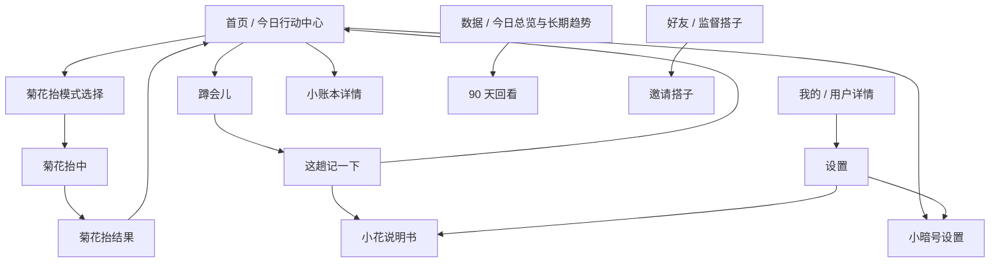

# 小提督 UI 交互设计文档

版本：v0.1
日期：2026-05-22
阶段：v0.1 当前完成版交互基线
关联文档：[产品定位文档](./product-positioning.md)、[PRD](./prd-v0.1.md)、[开发方案](./development-plan.md)、[整体风格设计指南](./visual-style-guide.md)

## 1. 文档目的

本文档把当前产品和视觉规范转化为可执行的 UI 与交互规则，覆盖首页、菊花抬、蹲会儿、小账本、小暗号、最近小报告、小花说明书和设置页。

本文档不是医疗内容审核文档，也不是视觉稿源文件。涉及健康风险时，只定义交互优先级和表达边界，不判断病因，不提供治疗方案。

## 2. 体验目标

小提督是一款面向久坐人群的私密健康习惯工具，让用户在不尴尬、不复杂、不被吓唬的前提下，每天顺手完成菊花抬、蹲会儿、小账本和小暗号设置。

UI 方向：

**低声量的私密健康仪表盘。**

记忆点：

- 首页一眼看到今天做了什么。
- 菊花抬用明确节奏而不是复杂教程。
- 蹲会儿像一个克制的收工提醒。
- 小账本是一点即记的轻量记录。
- 风险场景立刻收起幽默，进入小花说明书。

## 3. 信息架构

当前 App 使用 **底部 Tab + 二级流程页**。一级页面为首页、数据、好友和我的；设置保留在“我的”的二级入口中。

路由职责：

| 路由 | 页面 | 主要职责 |
| --- | --- | --- |
| `/` | 首页 | 菊花抬、蹲会儿、今日小账本、小暗号引导 |
| `/trends` | 数据 | 今日总览、7 天、30 天和 90 天数据 |
| `/team` | 好友 | 监督搭子、小队和互动提醒 |
| `/me` | 我的 | 用户详情、账号能力和设置入口 |
| `/settings` | 设置 | 外观、小暗号、小花说明书、灵动岛计时、蹲会儿声音与提醒 |
| `/training` | 菊花抬 | 选择训练模式，查看今日训练进度 |
| `/training/session` | 菊花抬中 | 倒计时训练、暂停、结束、放弃确认 |
| `/training/complete` | 菊花抬结果 | 记录结果和正反馈 |
| `/toilet` | 蹲会儿 | 计时开始、计时中、暂停、收工 |
| `/toilet/complete` | 这趟记一下 | 选择体验、小信号、保存记录 |
| `/habits` | 小账本详情 | 按标准调整四项三档状态 |
| `/reminders` | 小暗号设置 | 提醒开关、隐私、多段勿扰 |
| `/safety` | 小花说明书 | 训练注意、停练条件、就医提示 |
| `/trends/advanced` | 90 天回看 | Pro 高级小报告和 90 天节奏图 |

导航原则：

- 底部 Tab 承载首页、数据、好友和我的一级入口。
- 二级页必须使用固定 `AppTopBar`。
- 训练中和蹲会儿进行中使用关闭图标，退出时必须确认。
- 结果页使用关闭图标，但不再二次确认。
- 风险提示卡的“查看小花说明书”都可以跳转到 `/safety`。

## 4. 全局交互规范

页面骨架：

- 普通页面使用 `Screen`，默认可滚动。
- `AppTopBar` 固定在滚动内容外，返回/关闭按钮不能滚动消失。
- 训练中和蹲会儿进行中使用 `scroll={false}`，保持计时区域稳定。

点击反馈：

- 可点击卡片和按钮使用轻微缩放或透明度反馈。
- 点击区域不小于 44。
- 状态不能只靠颜色表达，必须有文字或图标辅助。

颜色语义：

- `primary`：菊花抬、完成、正反馈。
- `info`：普通提示、蹲会儿早期状态。
- `privacy`：小暗号、隐私相关。
- `warning`：蹲会儿长会、注意但非风险。
- `danger`：明显便血、明显不适、就医提示。

动效原则：

- 轻、短、稳定。
- 不使用金币、积分、烟花、排行榜。
- 小账本满格和菊花抬完整完成可使用克制成功动效。
- 风险场景不使用庆祝动效。

## 5. 首页交互

首页目标：打开后 3 秒内知道今天做了什么、下一步做什么。

首页顺序：

1. 顶部品牌和设置按钮。
2. 今日概览：菊花抬、小账本、蹲会儿。
3. 未开启提醒时的小暗号前置引导。
4. 菊花抬主行动卡。
5. 蹲会儿紧凑入口。
6. 今日小账本快速打卡。
7. 最近小报告、小暗号状态、小花说明书等轻量工具入口。

小暗号前置规则：

- 当菊花抬提醒和久坐提醒都未开启时展示。
- 开启任一提醒后隐藏前置引导。
- 底部工具区不重复展示未开启提醒入口。

首页状态文案：

| 模块 | 状态 |
| --- | --- |
| 菊花抬 | 待营业、已开张、已下班 |
| 小账本 | 待开张、已记录、满格 |
| 蹲会儿 | 未记录、已入账 |

## 6. 菊花抬交互

模式选择：

| 模式 | 节奏 | 图标差异 |
| --- | --- | --- |
| 新手 | 3 秒收紧 / 3 秒放松 / 10 次 | 小花缩小，弧线短且轻 |
| 标准 | 5 秒收紧 / 5 秒放松 / 12 次 | 完整弧线和节奏点 |
| 快速 | 1 秒收紧 / 1 秒放松 / 16 次 | 更高弧线和速度线 |

训练中：

- 显示当前阶段、倒计时、进度和次数。
- 支持暂停、继续、结束。
- 关闭按钮弹出放弃确认。
- 中途结束可保存未完整完成记录。

完成页：

- 完整完成显示成功反馈和轻量动效。
- 未完整完成不做负面评价，强调“身体说了算”。

## 7. 蹲会儿交互

启动页：

- 标题：蹲会儿。
- 说明：开始前先把手机小剧场关一关。
- 按钮：开始计时。
- 图标：`Armchair`，表达短暂停留。

计时中：

- 标题：办正事中。
- 显示大倒计时。
- 操作：收工、暂停/继续。
- 关闭按钮弹出放弃确认。

阶段规则：

| 时间 | 标题 | 交互反馈 |
| --- | --- | --- |
| 0-4:59 | 刚刚蹲下 | 主色/普通提示 |
| 5:00-9:59 | 小声敲门 | info、轻提醒 |
| 10:00-14:59 | 差不多该收工了 | warning、准备收工 |
| 15:00-19:59 | 蹲会儿长会了 | warning、已经偏久 |
| 20:00+ | 真的该收工了 | danger、加重提醒 |

阶段提醒：

- 前台阶段切换：视觉变化 + haptic + 阶段音效。
- 阶段音效默认开启，但遵循系统静音状态。
- 后台/锁屏：如果开启“蹲会儿离开提醒”，排本地通知。
- 本地通知默认不播放声音。
- 暂停、收工、放弃、回前台时取消未触发的阶段通知。

收工记录：

- 选择这趟感觉：顺畅、一般、困难。
- 可选小信号：明显不舒服、明显便血。
- 长会只用 warning，不等同于危险。
- 明显不舒服或明显便血使用 danger，并提供小花说明书入口。

## 8. 小账本交互

首页快速打卡：

- 未记录：点击记为达标。
- 已达标：再次点击撤销为未记录。
- 已记录为不足或一般：点击改为达标。
- 不显示“再点撤销”这类操作提示，减少界面噪音。
- 每项显示短标准：8 杯、2 餐+、30 分钟、少用力。

详情页：

- 每项标题下显示达标参考。
- 未记录时不展开三档标准，只显示达标参考和“先按一般记”。
- 已记录后显示三档滑块。
- 当前状态图标跟随标题展示。
- 滑块切换要丝滑，不得超出边界。

固定标准：

| 项目 | 达标参考 |
| --- | --- |
| 今日饮水 | 8 杯左右，约 200ml 一杯 |
| 膳食纤维 | 至少 2 餐有蔬菜，再补水果、全谷或豆类之一 |
| 活动/走动 | 累计走动或活动约 30 分钟 |
| 排便顺畅度 | 少用力、用时短、没有明显痛或血 |

## 9. 小暗号设置交互

提醒能力：

- 菊花抬固定时间提醒。
- 久坐定时活动提醒。
- 隐私模式。
- 多段勿扰。

勿扰规则：

- 支持快速方案：夜间勿扰、午休 + 夜间、关闭勿扰。
- 支持手动添加范围，最多 4 段。
- 每段支持调整开始和结束时间。
- 可删除任意时间段。

权限规则：

- 系统通知权限在需要时请求。
- 权限被拒绝时设置可保存，但通知不会触发。
- 权限问题由提醒设置页处理，首页不新增强警告。

## 10. 最近小报告交互

页面目标：轻量复盘，不卷数字。

结构：

1. 顶栏：最近小报告。
2. 顶部反馈卡。
3. 近 7 天小报告。
4. 近 30 天回看。
5. 小信号风险提示。

图表规则：

- 不引入图表库，用小柱状条展示。
- 菊花抬柱表示每日完整完成组数。
- 小账本柱表示每日完成项数，满格日高亮。
- 蹲会儿只展示是否记过；长会用 warning，小信号用 danger。
- 无记录时显示空状态，不展示空图表。

文案规则：

- 使用“小报告、回看、营业、满格、蹲会儿长会”等表达。
- 小信号只负责提示，不做庆祝。
- 明显便血、不适加重或剧烈疼痛时建议咨询医生。

## 11. 小花说明书交互

页面目标：轻松说明日常边界，但风险信号清楚可信。

模块：

- 怎么抬比较不费戏。
- 这些时候先让小花下班。
- 这些信号问专业队友。
- 常见小翻车。

风险表达规则：

- 明显便血、剧烈疼痛、不适加重必须明确。
- 不使用玩笑淡化风险。
- 不输出诊断结论。
- 明确建议咨询医生。

## 12. 设置页交互

设置页承载低频管理：

- 外观模式。
- 小暗号设置入口。
- 小花说明书入口。
- 灵动岛计时。
- 蹲会儿离开提醒。
- 阶段音效。

灵动岛计时：

- 默认关闭。
- 开启后锁屏和灵动岛会显示蹲会儿计时。
- 明确说明 Expo Go 不生效，需 development build 或正式包。

阶段音效：

- 默认开启。
- 只在 App 前台阶段切换时播放。
- 遵循系统静音状态，不强制绕过静音。

## 13. 可访问性和验收

可访问性：

- 所有可点击入口设置明确 `accessibilityRole`。
- 选中状态不只靠颜色表达。
- 图标必须有文字标签辅助。
- 深色模式下 warning、danger 和主色保持可读。

验收重点：

- 首页状态、提醒前置、主行动和小账本都能在小屏幕上清楚展示。
- 所有二级页顶栏固定，不随滚动消失。
- 菊花抬、蹲会儿、小账本、最近小报告流程可正常进出。
- 小账本快速打卡可达标、可撤销。
- 蹲会儿 5/10/15/20 分钟阶段差异清楚。
- 小暗号多段勿扰可添加、调整、删除。
- 风险场景入口能进入小花说明书。
- 灵动岛计时只在开发构建或正式包验收。

## 14. 当前结论

当前 UI 的核心闭环是：

**打开首页看到今天状态 -> 顺手完成一件小事 -> 获得轻量确认 -> 最近小报告看到坚持 -> 风险场景进入小花说明书。**

后续新增功能必须优先保护首页轻量度、隐私感和安全边界。
